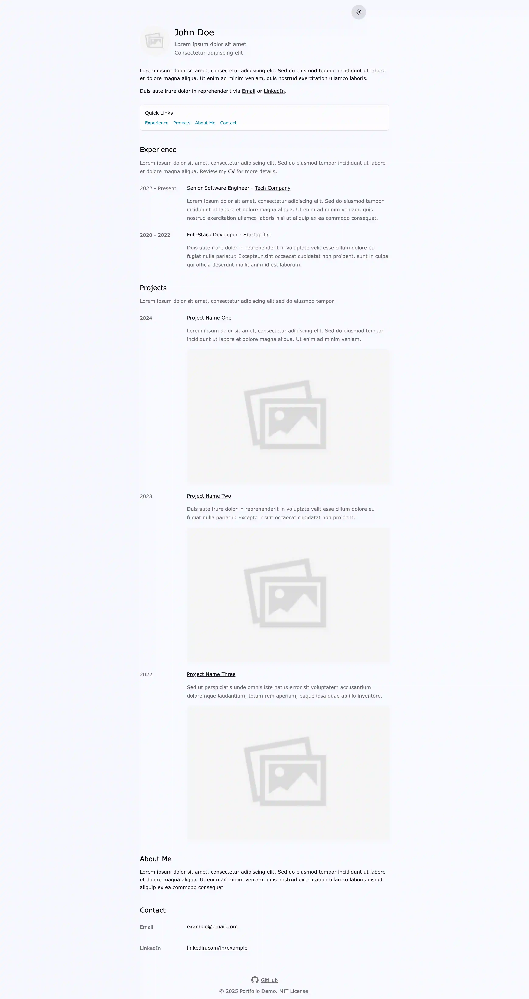

# Minimal One-Page Portfolio Site

**Live demo:** https://www.benmor.se

> ### Disclaimer
> This was a fun weekend project to quickly launch my own portfolio. I won’t be actively maintaining this repo, but feel free to use or modify the code. Dependencies are pinned to exact versions, so as long as you use the Node version specified in `.nvmrc`, the build should work reliably.  
> Once built, you can deploy the `static` directory to any CDN.

## Description
A minimal, sustainable portfolio site designed to keep the initial HTML + CSS + JS payload under **14 KB**, inspired by <a href="https://endtimes.dev/why-your-website-should-be-under-14kb-in-size/" target="_blank">this article</a>.

## About
This project provides a simple, low-maintenance one-page portfolio optimized for extremely small first-load size. The build process aggressively minimizes output so the initial request stays comfortably under **14 KB**, improving performance under <a href="https://hpbn.co/building-blocks-of-tcp/#slow-start" target="_blank">TCP Slow Start</a> and can be statically hosted.

This is done via a custom Webpack configuration which handles:

- Renaming and shortening CSS class names  
- Inlining and minifying CSS
- Inlining and minifying JavaScript
- CSS and JS minifiers
- Minifying HTML (removing unnecessary whitespace and newlines)

The result is a compact, static site that can be deployed directly to any CDN.

## Instructions
1. Run `npm run install` and `npm run dev`
2. Edit files in the `./src` directory.  
3. Run `npm run build` and deploy the contents of the `static` directory to your CDN of choice.

To test a production build locally:

```sh
npm run build && npm run serve
```

## Screenshots

<div style="display: flex; gap: 16px; flex-wrap: wrap; margin-top: 16px;">
  
  
</div>
